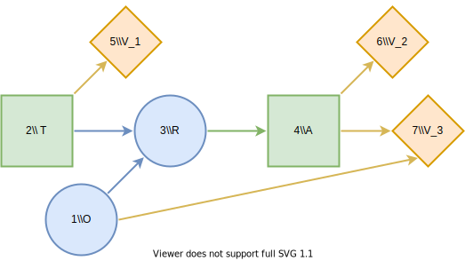

# pyDecisionProgramming
Python interface for DecisionProgramming.jl

## Installation
### Ubuntu 20.04:

1. Install manual requirements
 * Python3: install using `sudo apt install python3 python3-pip`
 * Julia: Download and follow setup instructions
 * Gurobi: download and follow the setup instructions

2. Install Julia-side dependencies:
```
julia setup.jl
```

3. Install python dependencies:
```
pip3 install -r requirements.txt
```

## Usage

To run REPL use `python-jl` (or `python-jl -m IPython`).

Set up the a new project using
```
import pyDecisionProgramming as pd
pd.setup_project()
```


# Used Car Buyer
## Description
To illustrate the basic functionality of Decision Programming, we implement a version of the used car buyer problem in [^1]. In this problem, Joe is buying a used car. The car's price is 1000 USD (US dollars), and its value is 1100 USD. Joe's base profit on the car is thus 100 USD. However, Joe knows that the car is a "lemon", meaning that it has defects in 6 major systems, with a 20% probability. With the remaining 80% probability, the car is a "peach", and it has a defect in only one of the systems.

The repair costs for a peach are only 40 USD, decreasing Joe's profit to 60  USD. However, the costs for a lemon are 200 USD, resulting in a total loss of 100 USD. We can now formulate an influence diagram of Joe's initial problem. We present the influence diagram in the figure below. In an influence diagram, circle nodes such as $O$ are called **chance nodes**, representing uncertainty. Node $O$ is a chance node representing the state of the car, lemon or peach. Square nodes such as $A$ are **decision nodes**, representing decisions. Node $A$ represents the decision to buy or not to buy the car. The diamond-shaped **value node** $V$ denotes the utility calculation in the problem. For Joe, the utility function is the expected monetary value. The arrows or **arcs** show connections between nodes. The two arcs in this diagram point to the value node, meaning that the monetary value depends on the state of the car and the purchase decision.


We can easily determine the optimal strategy for this problem. If Joe decides not to buy the car, his profit is zero. If he buys the car, with 20% probability he loses 100 USD and with an 80% probability he profits 60 USD. Therefore, the expected profit for buying the car is 28 USD, which is higher than the zero profit of not buying. Thus, Joe should buy the car.

We now add two new features to the problem. A stranger approaches Joe and offers to tell Joe whether the car is a lemon or a peach for 25 USD. Additionally, the car dealer offers a guarantee plan which costs 60 USD and covers 50% of the repair costs. Joe notes that this is not a very good deal, and the dealer includes an anti-lemon feature: if the total repair cost exceeds 100 USD, the quarantee will fully cover the repairs.

## Influence diagram



We present the new influence diagram above. The decision node $T$ denotes the decision to accept or decline the stranger's offer, and $R$ is the outcome of the test. We introduce new value nodes $V_1$ and $V_2$ to represent the testing costs and the base profit from purchasing the car. Additionally, the decision node $A$ now can choose to buy with a guarantee.

```python
import numpy as np
import pyDecisionProgramming as pd
pd.activate()

o = 1
t = 2
r = 3
a = 4
O_states = ["lemon", "peach"]
T_states = ["no test", "test"]
R_states = ["no test", "lemon", "peach"]
A_states = ["buy without guarantee", "buy with guarantee", "don\'t buy"]

s = pd.States([
 (len(O_states), o),
 (len(T_states), t),
 (len(R_states), r),
 (len(A_states), a),
])

c = pd.Vector('ChanceNode')
d = pd.Vector('DecisionNode')
v = pd.Vector('ValueNode')
x = pd.Vector('Probabilities')
y = pd.Vector('Consequences')
```

We start by defining the influence diagram structure. The decision and chance nodes, as well as their states, are defined in the first block. Next, the influence diagram parameters consisting of the node sets, probabilities, consequences and the state spaces of the nodes are defined.

### Car's State

The chance node $O$ is defined by its information set $I(O)$ and probability distribution $X_O$. As seen in the influence diagram, the information set is empty and the node is a root node. The probability distribution is thus simply defined over the two states of $O$.

```python
i_o = pd.Vector('Node')
c.push(pd.ChanceNode(o, i_o))
x.push(pd.Probabilities(o, [0.2, 0.8]))
```

### Stranger's Offer Decision

A decision node is simply defined by its information state.

```python
i_t = pd.Vector('Node')
d.push(pd.DecisionNode(t, i_t))
```

### Test's Outcome

The second chance node, $R$, has nodes $O$ and $T$ in its information set, and the probabilities $ℙ(s_j∣𝐬_{I(j)})$ must thus be defined for all combinations of states in $O$, $T$ and $R$.

```python
i_r = [o, t]
x_r = np.zeros((s[o], s[t], s[r]))
x_r[0, 0, :] = [1.0, 0.0, 0.0]
x_r[0, 1, :] = [0.0, 1.0, 0.0]
x_r[1, 0, :] = [1.0, 0.0, 0.0]
x_r[1, 1, :] = [0.0, 0.0, 1.0]
c.push(pd.ChanceNode(r, i_r))
x.push(pd.Probabilities(r, x_r))
```

### Purchase Decision
```python
i_a = [r]
d.push(pd.DecisionNode(a, i_a))
```

### Testing Cost

We continue by defining the utilities (consequences) associated with value nodes. The value nodes are defined similarly as the chance nodes, except that instead of probabilities, we define consequences $Y_j(𝐬_{I(j)})$. Value nodes can be named just like the other nodes, e.g. $V1 = 5$, but considering that the index of value nodes is not needed elsewhere (value nodes can't be in information sets), we choose to simply use the index number when creating the node.

```python
i_v1 = [t]
y_v1 = [0.0, -25.0]
v.push(pd.ValueNode(5, i_v1))
y.push(pd.Consequences(5, y_v1))
```

### Base Profit of Purchase
```python
i_v2 = [a]
y_v2 = [100.0, 40.0, 0.0]
v.push(pd.ValueNode(6, i_v2))
y.push(pd.Consequences(6, y_v2))
```

### Repairing Cost

The rows of the consequence matrix Y_V3 correspond to the state of the car, while the columns correspond to the decision made in node $A$.

```python
i_v3 = [o, a]
y_v3 = [[-200.0, 0.0, 0.0],
        [-40.0, -20.0, 0.0]]
v.push(pd.ValueNode(7, i_v3))
y.push(pd.Consequences(7, y_v3))
```

### Validating Influence Diagram
Validate influence diagram and sort nodes, probabilities and consequences

```python
pd.validate_influence_diagram(s, c, d, v)
for vec in (c, d, v, x, y):
    vec.sortByNode()
```

Default path probabilities and utilities are defined as the joint probability of all chance events in the diagram and the sum of utilities in value nodes, respectively. In the [Contingent Portfolio Programming](contingent-portfolio-programming.md) example, we show how to use a user-defined custom path utility function.

```python
p = pd.DefaultPathProbability(c, x)
u = pd.DefaultPathUtility(v, y)
```


## Decision Model
We then construct the decision model using the DecisionProgramming.jl package, using the expected value as the objective.

```python
model = pd.Model()
z_var = pd.DecisionVariables(model, s, d)
pi_s = pd.PathProbabilityVariables(model, z_var, s, p)
ev = pd.expected_value(model, pi_s, u)
pd.set_objective(model, 'Max', ev)
```

We can perform the optimization using an optimizer such as Gurobi.

```python
pd.setup_Gurobi_optimizer(
   model,
   ("IntFeasTol", 1e-9),
   ("LazyConstraints", 1)
)
pd.optimize(model)
```


## Analyzing Results
### Decision Strategy
Once the model is solved, we obtain the following decision strategy:

```python
z = pd.DecisionStrategy(z_var)
```

```python-repl
pd.print_decision_strategy(s, z)
┌────────┬────┬───┐
│  Nodes │ () │ 2 │
├────────┼────┼───┤
│ States │ () │ 2 │
└────────┴────┴───┘
┌────────┬──────┬───┐
│  Nodes │ (3,) │ 4 │
├────────┼──────┼───┤
│ States │ (1,) │ 3 │
│ States │ (2,) │ 2 │
│ States │ (3,) │ 1 │
└────────┴──────┴───┘
```

To start explaining this output, let's take a look at the top table. On the right, we have the decision node 2. We defined earlier that the node $T$ is node number 2. On the left, we have the information set of that decision node, which is empty. The strategy in the first decision node is to choose alternative 2, which we defined to be testing the car.

In the bottom table, we have node number 4 (node $A$) and its predecessor, node number 3 (node $R$). The first row, where we obtain no test result, is invalid for this strategy since we tested the car. If the car is a lemon, Joe should buy the car with a guarantee (alternative 2), and if it is a peach, buy the car without guarantee (alternative 1).

### Utility Distribution
```python
udist = pd.UtilityDistribution(s, p, u, z)
```

```python-repl
>>> pd.print_utility_distribution(udist)
┌───────────┬─────────────┐
│   Utility │ Probability │
│   Float64 │     Float64 │
├───────────┼─────────────┤
│ 15.000000 │    0.200000 │
│ 35.000000 │    0.800000 │
└───────────┴─────────────┘
```

From the utility distribution, we can see that Joe's profit with this strategy is 15 USD, with a 20% probability (the car is a lemon) and 35 USD with an 80% probability (the car is a peach).

```python-repl
>>> print_statistics(udist)
┌──────────┬────────────┐
│     Name │ Statistics │
│   String │    Float64 │
├──────────┼────────────┤
│     Mean │  31.000000 │
│      Std │   8.000000 │
│ Skewness │  -1.500000 │
│ Kurtosis │   0.250000 │
└──────────┴────────────┘
```

The expected profit is thus 31 USD.


## References
[^1]: Howard, R. A. (1977). The used car buyer. Reading in Decision Analysis, 2nd Ed. Stanford Research Institute, Menlo Park, CA.
