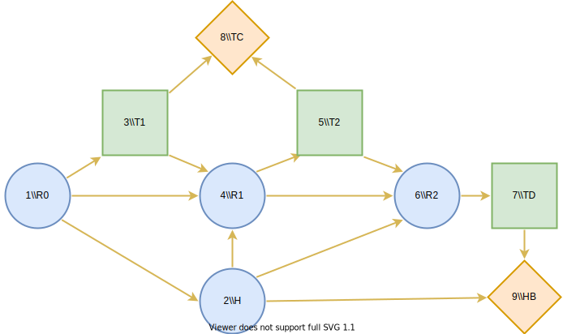

CHD preventative care allocation
================================

.. role:: python(code)
   :language: python

Description
...........

The goal in this optimisation problem is to determine an
optimal decision strategy for the testing and treatment
decisions involved in providing preventative care for
coronary heart disease (CHD). The optimality is evaluated
from the perspective of the national health care system and
is measured in quality-adjusted life-years (QALY). The
tests available in this model are the traditional risk
score (TRS) and the genetic risk score (GRS) and the form
of preventative care is statin treatment. The description
of the CHD preventative care allocation problem is below.
This description is from [#Hankimaa]_ from section 3.2.

  The problem setting is such that the patient is assumed
  to have a prior risk estimate. A risk estimate is a
  prediction of the patient’s chance of having a CHD event
  in the next ten years. The risk estimates are grouped
  into risk levels, which range from 0% to 100%. The first
  testing decision is made based on the prior risk
  estimate. The first testing decision entails deciding
  whether TRS or GRS should be performed or if no testing
  is needed. If a test is conducted, the risk estimate is
  updated and based on the new information, the second
  testing decision is made. The second testing decision
  entails deciding whether further testing should be
  conducted or not. The second testing decision is
  constrained so that the same test which was conducted in
  the first stage cannot be repeated. If a second test is
  conducted, the risk estimate is updated again. The
  treatment decision – dictating whether the patient
  receives statin therapy or not – is made based on the
  resulting risk estimate of this testing process. Note
  that if no tests are conducted, the treatment decision is
  made based on the prior risk estimate.

In this example, we will showcase the subproblem, which
optimises the decision strategy given a single prior risk
level. The chosen risk level in this example is 12%. The
solution to the main problem is found in [#Hankimaa]_.

Influence diagram
.................

The influence diagram representation of the problem is seen
above. The chance nodes RR represent the patient's risk
estimate – the prior risk estimate being :math:`R0`. The
risk estimate nodes :math:`R0`, :math:`R1` and :math:`R2`
have 101 states :math:`R = \{0\%, 1\%, ..., 100\%\}`, which
are the discretised risk levels for the risk estimates.

The risk estimate is updated according to the first and
second testing decisions, which are represented by decision
nodes :math:`T1` and :math:`T2`. These nodes have states
:math:`T = \{\text{TRS, GRS, no test}\}`. The health of the
patient, represented by chance node :math:`H`, also affects
the update of the risk estimate. In this model, the health
of the patient indicates whether they will have a CHD event
in the next ten years or not. Thus, the node has states
:math:`H = \{\text{CHD, no CHD}\}`. The treatment decision
is represented by node :math:`TD` and it has states
:math:`TD = \{\text{treatment, no treatment}\}`.

The prior risk estimate represented by node :math:`R0`
influences the health node :math:`H`, because in the model
we make the assumption that the prior risk estimate
accurately describes the probability of having a CHD event.

The value nodes in the model are :math:`TC` and :math:`HB`.
Node :math:`TC` represents the testing costs incurred due
to the testing decisions :math:`T1` and :math:`T2`. Node
:math:`HB` represents the health benefits achieved. The
testing costs and health benefits are measured in QALYs.
These parameter values were evaluated in the study
[#Hynninen]_.

We begin by declaring the chosen prior risk level and
reading the conditional probability data for the tests.
Note that the sample data in this repository is dummy data
due to distribution restrictions on the real data. We also
define functions :python:`update_risk_distribution` and
:python:`state_probabilities`. These functions will be
discussed in the following sections.

.. warning::

  The code snippets given in this example are not
  complete. For a full, executable example, see
  `examples/CHD.py`_ in the repository.

.. _examples/CHD.py: https://github.com/gamma-opt/pyDecisionProgramming/blob/main/examples/CHD.py

.. code-block:: Python

  import DecisionProgramming as dp
  import numpy as np
  import pandas as pd
  from types import SimpleNamespace

  dp.activate()

  data = pd.read_csv("examples/risk_prediction_data.csv")
  chosen_risk_level = "12%"

  def update_risk_distribution(prior, t):
    ...

  def state_probabilities(prior, t):
    ...

Initialise influence diagram
............................

We start defining the Decision Programming model by
initialising the influence diagram.

.. code-block:: Python

  diagram = dp.InfluenceDiagram()

For brevity in the next sections, we define the states of
the nodes to be readily available. Notice, that
:math:`R_{states}` is a vector with values
:math:`0\%, 1\%,\dots,100\%`.

.. code-block:: Python

  diagram = dp.InfluenceDiagram()

We then add the nodes. The chance and decision nodes are
identified by their names. When declaring the nodes, they
are also given information sets and states. Notice that
nodes :math:`R0` and :math:`H` are root nodes, meaning
that their information sets are empty. In Decision
Programming, we add the chance and decision nodes in the
following way.

.. code-block:: Python

  diagram.add_node(dp.ChanceNode("R0", [], R_states))
  diagram.add_node(dp.ChanceNode("R1", ["R0", "H", "T1"], R_states))
  diagram.add_node(dp.ChanceNode("R2", ["R1", "H", "T2"], R_states))
  diagram.add_node(dp.ChanceNode("H",  ["R0"], H_states))

  diagram.add_node(dp.DecisionNode("T1",  ["R0"], T_states))
  diagram.add_node(dp.DecisionNode("T2",  ["R1"], T_states))
  diagram.add_node(dp.DecisionNode("TD",  ["R2"], TD_states))

The value nodes are added in a similar fashion. However,
value nodes do not have states because they map their
information states to utility values instead.

.. code-block:: Python

  diagram.add_node(dp.ValueNode("TC",  ["T1", "T2"]))
  diagram.add_node(dp.ValueNode("HB",  ["H", "TD"]))

Generate arcs
.............

Now that all of the nodes have been added to the influence
diagram we generate the arcs between the nodes. This step
automatically orders the nodes, gives them indices and
reorganises the information into the appropriate form.

.. code-block:: Python

  diagram.generate_arcs()

Probabilities of the prior risk estimate and health of the patient
..................................................................

In this subproblem, the prior risk estimate is given and
therefore the node :math:`R0` is in effect a deterministic
node. In Decision Programming a deterministic node is
added as a chance node for which the probability of one
state is set to one and the probabilities of the rest of
the states are set to zero. In this case

.. math::

   \mathbb P(R0=12\%) = 1

and :math:`\mathbb P(R0\neq 12\%) = 1`

The probability matrix of node :math:`R0` is added in the
following way. Remember that the
:python:`diagram.construct_probability_matrix` function
initialises the matrix with zeros.

.. code-block:: Python

  X_R0 = diagram.construct_probability_matrix("R0")
  X_R0[chosen_risk_level] = 1
  diagram.set_probabilities("R0", X_R0)

Next we add the state probabilities of node :math:`H`. For
modeling purposes, we define the information set of node
:math:`H` to include the prior risk node :math:`R0`. We
set the probability that the patient experiences a CHD
event in the next ten years according to the prior risk
level such that

.. math::

   \mathbb P(H=\textrm{CHD}\mid R0 = \alpha) = \alpha.

We set the probability that the patient does not
experience a CHD event in the next ten years as the
complement event.

.. math::

   \mathbb P(H=\textrm{no CHD}\mid R0 = \alpha) = 1-\alpha.

Since node :math:`R0` is deterministic and the health node
:math:`H` is defined in this way, in our model the patient
has a 12% chance of experiencing a CHD event and 88%
chance of remaining healthy.

In this Decision Programming model, the probability matrix of node :math:`H` has dimensions (101, 2) because its information set consisting of node :math:`R0` has 101 states and node :math:`H` has 2 states. We first set the column related to the state :math:`CHD` with values from :python:`data.risk_levels` which are 0.00, 0.01, ..., 0.99, 1.000.00,0.01,...,0.99,1.00 and the other column as its complement event.

.. code-block:: Python

  X_H = diagram.construct_probability_matrix("H")
  X_H[:, "CHD"] = data.risk_levels.tolist()
  X_H[:, "no CHD"] = (1-data.risk_levels).tolist()
  diagram.set_probabilities("H", X_H)

Probabilities of the updated the risk estimates
...............................................

For node :math:`R1`, the probabilities of the states are
calculated by aggregating the updated risk estimates into
the risk levels after a test is performed. The updated
risk estimates are calculated using the function update_risk_distribution, which calculates the posterior probability distribution for a given health state, test and prior risk estimate.

.. code-block:: Python

  X_H = diagram.construct_probability_matrix("H")
  X_H[:, "CHD"] = data.risk_levels.tolist()
  X_H[:, "no CHD"] = (1-data.risk_levels).tolist()
  diagram.set_probabilities("H", X_H)

Probabilities of the updated the risk estimates
...............................................

For node :math:`R1`, the probabilities of the states are calculated by aggregating the updated risk estimates into the risk levels after a test is performed. The updated risk estimates are calculated using the function :python:`update_risk_distribution`, which calculates the posterior probability distribution for a given health state, test and prior risk estimate.

.. math::

   risk estimate = P(\textrm{CHD}\mid \textrm{test result}) = \frac{P(\textrm{test result}\mid \textrm{CHD})P(\textrm{CHD})}{P(\textrm{test result})}

The probabilities
:math:`P(\text{test result} \mid \text{CHD})` are test
specific and these are read from the CSV data file. The
updated risk estimates are aggregated according to the
risk levels. These aggregated probabilities are then the
state probabilities of node :math:`R1`. The aggregating is
done using function :python:`state_probabilities`.

In Decision Programming the probability distribution over
the states of node :math:`R1` is defined into a
probability matrix with dimensions :math:`(101,2,3,101)`.
This is because its information set consists of nodes
:math:`R0, H` and, :math:`T` which have 101, 2 and 3
states respectively and the node R1R1 itself has 101
states. Here, one must know that in Decision Programming
the states of the nodes are mapped to numbers in the back-
end. For instance, the health states :math:`\text{CHD}`
and :math:`\text{no CHD}` are indexed 1 and 2. The testing
decision states TRS, GRS and no test are 1, 2 and 3. The
order of the states is determined by the order in which
they are defined when adding the nodes. Knowing this, we
can set the probability values into the probability matrix
using a very compact syntax. Notice that we add 101
probability values at a time into the matrix.

.. code-block:: Python

  X_R = diagram.construct_probability_matrix("R1")
  for s_R0 in range(n_risk_levels):
     for s_H in range(2):
        for s_T1 in range(3):
           risk = update_risk_distribution(s_R0, s_T1)
           probs = state_probabilities(risk, s_T1, s_H, s_R0)
           X_R[s_R0, s_H, s_T1, :] = probs.tolist()

  diagram.set_probabilities("R1", X_R)

We notice that the probability distruption is identical in
:math:`R1` and :math:`R2` because their information states
are identical. Therefore we can simply add the same matrix
from above as the probability matrix of node :math:`R2`.

.. code-block:: Python

  diagram.set_probabilities("R2", X_R)

Utilities of testing costs and health benefits
..............................................

We define a utility matrix for node :math:`TC`, which maps
all its information states to testing costs. The unit in
which the testing costs are added is quality-adjusted life-
year (QALYs). The utility matrix is defined and added in
the following way.

.. code-block:: Python

  cost_TRS = -0.0034645
  cost_GRS = -0.004
  forbidden = 0   # the cost of forbidden test combinations is neglected

  Y_TC = diagram.construct_utility_matrix("TC")
  Y_TC["TRS", "TRS"] = forbidden
  Y_TC["TRS", "GRS"] = cost_TRS + cost_GRS
  Y_TC["TRS", "no test"] = cost_TRS
  Y_TC["GRS", "TRS"] = cost_TRS + cost_GRS
  Y_TC["GRS", "GRS"] = forbidden
  Y_TC["GRS", "no test"] = cost_GRS
  Y_TC["no test", "TRS"] = cost_TRS
  Y_TC["no test", "GRS"] = cost_GRS
  Y_TC["no test", "no test"] = 0
  diagram.set_utility("TC", Y_TC)

The health benefits that are achieved are determined by
whether treatment is administered and by the health of the
patient. We add the final utility matrix to the model.

.. code-block:: Python

  Y_HB = diagram.construct_utility_matrix("HB")
  Y_HB["CHD", "treatment"] = utility_CHD_treated
  Y_HB["CHD", "no treatment"] = utility_CHD_nottreated
  Y_HB["no CHD", "treatment"] = utility_noCHD_treated
  Y_HB["no CHD", "no treatment"] = utility_noCHD_nottreated
  diagram.set_utility("HB", Y_HB)

Generate influence diagram
..........................

Finally, we generate the full influence diagram before
defining the decision model. By default this function uses
the default path probabilities and utilities, which are
defined as the joint probability of all chance events in
the diagram and the sum of utilities in value nodes,
respectively. In the `Contingent Portfolio Programming
<contingent-portfolio-programming.html>`_ example, we show
how to use a user-defined custom path utility function.

.. code-block:: Python

  diagram.generate()

Decision Model
..............

We define the JuMP model and declare the decision variables.

.. code-block:: Python

  model = dp.Model()
  z = diagram.decision_variables(model)

In this problem, we want to forbid the model from choosing
paths where the same test is repeated twice and where the
first testing decision is not to perform a test but the
second testing decision is to perform a test. We forbid
the paths by declaring these combinations of states as
forbidden paths.

.. code-block:: Python

  forbidden_tests = diagram.forbidden_path(["T1", "T2"], [("TRS", "TRS"), ("GRS", "GRS"), ("no test", "TRS"), ("no test", "GRS")])

We fix the state of the deterministic :math:`R0` node by
declaring it as a fixed path. Fixing the state of node
:math:`R0` is not necessary because of how the
probabilities were defined. However, the fixed state
reduces the need for some computation in the back-end.

.. code-block:: Python

  fixed_R0 = diagram.fixed_path({"R0": chosen_risk_level})

We also choose a scale factor of 10000, which will be used
to scale the path probabilities. The probabilities need to
be scaled because in this specific problem they are very
small since the :math:`R` nodes have a large number of
states. Scaling the probabilities helps the solver find an
optimal solution.

We then declare the path compatibility variables. We fix
the state of the deterministic :math:`R0` node , forbid
the unwanted testing strategies and scale the
probabilities by giving them as parameters in the function
call.

.. code-block:: Python

  scale_factor = 10000.0
  x_s = diagram.path_compatibility_variables(
      model, z,
      fixed=fixed_R0,
      forbidden_paths=[forbidden_tests],
      probability_cut=False,
      probability_scale_factor=scale_factor
  )

We define the objective function as the expected value.

.. code-block:: Python

  EV = diagram.expected_value(model, x_s)
  model.objective(EV, "Max")

We set up the solver for the problem and optimise it.

.. code-block:: Python

  model.setup_Gurobi_optimizer(
     ("MIPFocus", 3),
     ("MIPGap", 1e-6)
  )
  model.optimize()

Analyzing results
.................

We extract the results in the following way.

.. code-block:: Python

  Z = z.decision_strategy()
  S_probabilities = diagram.state_probabilities(Z)
  U_distribution = diagram.utility_distribution(Z)

Decision strategy
.................

We inspect the decision strategy. From the printout, we
can see that when the prior risk level is 12% the optimal
decision strategy is to first perform TRS testing. At the
second decision stage, GRS should be conducted if the
updated risk estimate is between 16% and 28% and otherwise
no further testing should be conducted. Treatment should
be provided to those who have a final risk estimate
greater than 18%. Notice that the incompatible states are
not included in the printout. The incompatible states are
those that have a state probability of zero, which means
that given this data it is impossible for the patient to
have their risk estimate updated to those risk levels.

.. code-block::

  In [1]: S_probabilities.print_decision_strategy()

  Out[1]:
  ┌────────────────┬────────────────┐
  │ State(s) of R0 │ Decision in T1 │
  ├────────────────┼────────────────┤
  │ 12%            │ TRS            │
  └────────────────┴────────────────┘
  ┌────────────────┬────────────────┐
  │ State(s) of R1 │ Decision in T2 │
  ├────────────────┼────────────────┤
  │ 0%             │ no test        │
  │ 1%             │ no test        │
  │ 3%             │ no test        │
  │ 6%             │ no test        │
  │ 7%             │ no test        │
  │ 10%            │ no test        │
  │ 11%            │ no test        │
  │ 13%            │ no test        │
  │ 14%            │ no test        │
  │ 16%            │ GRS            │
  │ 17%            │ GRS            │
  │ 18%            │ GRS            │
  │ 21%            │ GRS            │
  │ 22%            │ GRS            │
  │ 23%            │ GRS            │
  │ 28%            │ no test        │
  │ 29%            │ no test        │
  │ 31%            │ no test        │
  │ 34%            │ no test        │
  │  ⋮             │    ⋮            │
  └────────────────┴────────────────┘
                                  rows omitted

  ┌────────────────┬────────────────┐
  │ State(s) of R2 │ Decision in TD │
  ├────────────────┼────────────────┤
  │ 0%             │ no treatment   │
  │ 1%             │ no treatment   │
  │ 2%             │ no treatment   │
  │ 3%             │ no treatment   │
  │ 6%             │ no treatment   │
  │ 7%             │ no treatment   │
  │ 8%             │ no treatment   │
  │ 9%             │ no treatment   │
  │ 10%            │ no treatment   │
  │ 11%            │ no treatment   │
  │ 12%            │ no treatment   │
  │ 13%            │ no treatment   │
  │ 14%            │ no treatment   │
  │ 15%            │ no treatment   │
  │ 16%            │ no treatment   │
  │ 17%            │ no treatment   │
  │ 18%            │ treatment      │
  │ 19%            │ treatment      │
  │ 20%            │ treatment      │
  │  ⋮             │    ⋮            │
  └────────────────┴────────────────┘
                                  rows omitted

Utility distribution
....................

We can also print the utility distribution for the optimal strategy and some basic statistics for the distribution.

.. code-block::

  In [2]: S_probabilities.print_decision_strategy()

  Out[2]:
  ┌──────────┬─────────────┐
  │  Utility │ Probability │
  │  Float64 │     Float64 │
  ├──────────┼─────────────┤
  │ 6.646904 │    0.005318 │
  │ 6.650904 │    0.038707 │
  │ 6.889672 │    0.011602 │
  │ 6.893672 │    0.064374 │
  │ 7.637820 │    0.034188 │
  │ 7.641820 │    0.073974 │
  │ 7.693419 │    0.035266 │
  │ 7.697419 │    0.736573 │
  └──────────┴─────────────┘

  In [3]: S_probabilities.print_statistics()

  Out[3]:
  ┌──────────┬────────────┐
  │     Name │ Statistics │
  │   String │    Float64 │
  ├──────────┼────────────┤
  │     Mean │   7.583923 │
  │      Std │   0.291350 │
  │ Skewness │  -2.414877 │
  │ Kurtosis │   4.059711 │
  └──────────┴────────────┘

.. rubric:: References

.. [#Hankimaa] Hankimaa H. (2021). Optimising the use of genetic testing in prevention of CHD using Decision Programming. http://urn.fi/URN:NBN:fi:aalto-202103302644

.. [#Hynninen] Hynninen Y. (2019). Value of genetic testing in the prevention of coronary heart disease events. PLOS ONE, 14(1):1–16. https://doi.org/10.1371/journal.pone.0210010

