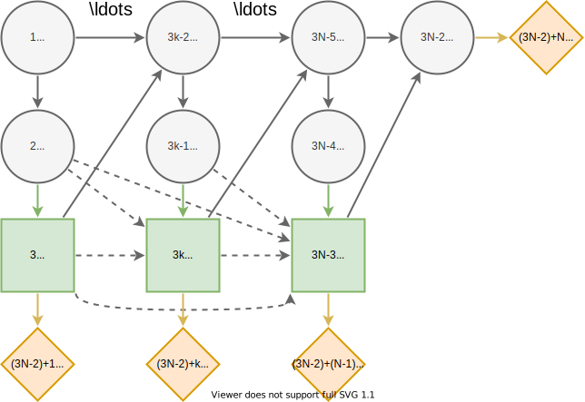

N-Monitoring
============

Description
...........

The :math:`N`-monitoring problem is described in  [#Salo]_,
sections 4.1 and 6.1.

Influence Diagram
.................

The influence diagram of the generalized
:math:`N`-monitoring problem where :math:`N\ge 1` and
indices :math:`k=1,...,N`. The nodes are associated with
states as follows. Load state :math:`L=\{high, low\}`
denotes the load on a structure, report states
:math:`R_k=\{high, low\}` report the load state to the
action states :math:`A_k=\{yes, no\}` which represent
different decisions to fortify the structure. The failure
state :math:`F=\{failure, success\}` represents whether or
not the (fortified) structure fails under the load
:math:`L`. Finally, the utility at target :math:`T` depends
on the fortification costs and whether F fails.

We begin by choosing :math:`N` and defining our
fortification cost function. We draw the cost of
fortification :math:`c_k∼U(0,1)` from a uniform
distribution, and the magnitude of fortification is
directly proportional to the cost. Fortification is defined
as

.. math::

   f(A_k = yes) = c_k\\
   f(A_k = no) = 0

.. code-block:: Python

  import pyDecisionProgramming as pdp
  import numpy as np

  pdp.activate()

  N = 4
  np.random.seed(13)
  c_k = np.random.random(N)
  b = 0.03

  def fortification(k, a):
      if not a:
          return c_k[k]
      else:
          return 0

Initialising the influence diagram
..................................

We initialise the influence diagram before adding nodes to
it.

.. code-block:: Python

  diagram = pdp.InfluenceDiagram()

Adding nodes
............

Add node :math:`L` which represents the load on the
structure. This node is the root node and thus, has an
empty information set. Its states describe the state of the
load, they are :math:`high` and :math:`low`.

.. code-block:: Python

  L = pdp.ChanceNode("L", [], ["high", "low"])
  diagram.add_node(L)

The report nodes :math:`R_k` and action nodes :math:`A_k`
are easily added with a for-loop. The report nodes have
node :math:`L` in their information sets and their states
are :math:`high` and :math:`low`. The actions are made
based on these reports, which is represented by the action
nodes :math:`A_k` having the report nodes :math:`R_k` in
their information sets. The action nodes have states
:math:`yes` and :math:`no`, which represents decisions
whether to fortify the structure or not.

.. code-block:: Python

  for i in range(N):
      R = pdp.ChanceNode(f"R{i}", ["L"], ["high", "low"])
      diagram.add_node(R)
      A = pdp.DecisionNode(f"A{i}", [f"R{i}"], ["yes", "no"])
      diagram.add_node(A)

The failure node :math:`F` has the load node :math:`L` and
all of the action nodes :math:`A_k`
in its information set. The failure node has states
:math:`failure` and :math:`success`.

.. code-block:: Python

  F = pdp.ChanceNode(
      "F",
      ["L", *[f"A{i}" for i in range(N)]],
      ["failure", "success"]
  )
  diagram.add_node(F)

The value node :math:`T` is added as follows.

.. code-block:: Python

  T = pdp.ValueNode("T", ["F", *[f"A{i}" for i in range(N)]])
  diagram.add_node(T)

Generating arcs
...............

Now that all of the nodes have been added to the influence
diagram we generate the arcs between the nodes. This step
automatically orders the nodes, gives them indices and
reorganises the information into the appropriate form.

.. code-block:: Python

  diagram.generate_arcs()

Load State Probabilities
........................

After generating the arcs, the probabilities and utilities
can be added. The probability that the load is high,
:math:`\mathcal P(L=high)`, is drawn from a uniform
distribution. For different syntax options for adding
probabilities and utilities, see the
`usage page <usage.html>`_.

.. code-block:: Python

   r = np.random.random()
   X_L = [r, 1.0-r]
   diagram.set_probabilities("L", X_L)

Reporting Probabilities
.......................

The probabilities of the report states correspond to the
load state. We draw the values :math:`x∼U(0,1)` and
:math:`y∼U(0,1)` from uniform distributions.

.. math::

   \mathcal P(R_k=high \mid L=high) = max\{x, 1-x\}\\
   \mathcal P(R_k=low \mid L=low) = max\{y, 1-y\}

The probability of a correct report is thus in the range
[0.5,1]. (This reflects the fact that a probability under
50% would not even make sense, since we would notice that
if the test suggests a high load, the load is more likely
to be low, resulting in that a low report "turns into" a
high report and vice versa.)

In Decision Programming we add these probabilities by
declaring probability matrices for nodes :math:`R_k`.
The probability matrix of a report node :math:`R_k` has
dimensions (2,2), where the rows correspond to the states
:math:`high` and :math:`low` of its predecessor node
:math:`L` and the columns to its own states :math:`high`
and :math:`low`.

.. code-block:: Python

   for i in range(N):
       x, y = np.random.random(2)
       x = np.max([x, 1-x])
       y = np.max([y, 1-y])
       X_R = diagram.construct_probability_matrix(f"R{i}")
       X_R["high", "high"] = x
       X_R["high", "low"] = 1 - x
       X_R["low", "low"] = y
       X_R["low", "high"] = 1 - y
       diagram.set_probabilities(f"R{i}", X_R)

Probability of Failure
......................

The probability of failure is decreased by fortification
actions. We draw the values :math:`x∼U(0,1)` and
:math:`y∼U(0,1)` from uniform distribution.

.. math::

   \mathcal P(F=failure \mid A_N,\dots,A_1,L=high) = \frac{\max\{x,1-x\}}{exp\left( b\sum_{k=1,\dots,N}f(A_k) \right)}\\
   \mathcal P(F=failure \mid A_N,\dots,A_1,L=high) = \frac{\max\{x,1-x\}}{exp\left( b\sum_{k=1,\dots,N}f(A_k) \right)}

First we initialise the probability matrix for node
:math:`F`.

.. code-block:: Python

   X_F = diagram.construct_probability_matrix("F")

.. rubric:: References

.. [#Salo] Salo, A., Andelmin, J., & Oliveira, F. (2019). Decision Programming for Multi-Stage Optimization under Uncertainty, 1–35. Retrieved from http://arxiv.org/abs/1910.09196
