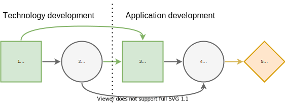

Contingent Portfolio Programming
================================

.. warning::

  This example discusses adding constraints and decision
  variables to the Decision Programming formulation, as
  well as custom path utility calculation. Because of this,
  it is quite advanced compared to the earlier ones.

Description
...........

[#Salo]_, section 4.2:

  For instance, assume that the first-stage decisions
  specify which technology development projects will be
  started to generate patent-based intellectual property
  :math:`(P)` for a platform. This intellectual property
  contributes subject to some uncertainties to the
  technical competitiveness :math:`(T)` of the platform. In
  the second stage, it is possible to carry out application
  :math:`(A)` development projects which, when completed,
  yield cash flows that depend on the market share of the
  platform. This market share :math:`(M)` depends on the
  competitiveness of the platform and the number of
  developed applications. The aim is to maximize the cash
  flows from application projects less the cost of
  technology and application development projects.

Influence Diagram: Projects
...........................

The influence diagram of the contingent portfolio
programming (CPP) problem.

There are :math:`n_T` technology development projects and
:math:`n_A` application development projects.

Decision states to develop patents

.. math::

   d_i^P \in D_i^P = \left \{ [q_1^P,q_2^P), [q_2^P,q_3^P)  \dots, [q_{|D^P|}^P,q_{|D^P|+1}^P) \right \}.

Chance states of technical competitiveness
:math:`c_j^T \in C_j^T`.

Decision states to develop applications

.. math::

   d_k^A \in D^A = \left \{ [q_1^A,q_2^A), [q_2^A,q_3^A)  \dots, [q_{|D^A|}^A,q_{|D^A|+1}^A) \right \}.

Chance states of market size :math:`c_j^M \in C_j^M`.

.. code-block:: Python

  import pyDecisionProgramming as pdp
  import numpy as np

  pdp.activate()
  np.random.seed(42)

  diagram = pdp.InfluenceDiagram()

  DP = pdp.DecisionNode("DP", [], ["0-3 patents", "3-6 patents", "6-9 patents"])
  diagram.add_node(DP)

  CT = pdp.ChanceNode("CT", ["DP"], ["low", "medium", "high"])
  diagram.add_node(CT)

  DA = pdp.DecisionNode("DA", ["DP", "CT"], ["0-5 applications", "5-10 applications", "10-15 applications"])
  diagram.add_node(DA)

  CM = pdp.ChanceNode("CM", ["CT", "DA"], ["low", "medium", "high"])
  diagram.add_node(CM)

  diagram.generate_arcs()

Technical competitiveness probability
.....................................

Probability of technical competitiveness :math:`c^T_j`
given the range
:math:`d_i^P:\mathbb P(c_j^T\mid d_i^P) \in [0,1]`.
A high number of patents increases probability of high
competitiveness and a low number correspondingly increases
the probability of low competitiveness.

.. code-block:: Python

  X_CT = diagram.construct_probability_matrix("CT")
  X_CT[0, :] = [1/2, 1/3, 1/6]
  X_CT[1, :] = [1/3, 1/3, 1/3]
  X_CT[2, :] = [1/6, 1/3, 1/2]
  diagram.set_probabilities("CT", X_CT)

Market share probability
........................

Probability of market share :math:`c^M_l` given the
technical competitiveness :math:`c^T_j` and range
:math:`d_k^A:\mathbb P(c_l^M\mid d_j^T, d_k^A) \in [0,1]`.
Higher competitiveness and number of application projects
both increase the probability of high market share.

.. code-block:: Python

  X_CM = diagram.construct_probability_matrix("CM")
  X_CM[0, 0, :] = [2/3, 1/4, 1/12]
  X_CM[0, 1, :] = [1/2, 1/3, 1/6]
  X_CM[0, 2, :] = [1/3, 1/3, 1/3]
  X_CM[1, 0, :] = [1/2, 1/3, 1/6]
  X_CM[1, 1, :] = [1/3, 1/3, 1/3]
  X_CM[1, 2, :] = [1/6, 1/3, 1/2]
  X_CM[2, 0, :] = [1/3, 1/3, 1/3]
  X_CM[2, 1, :] = [1/6, 1/3, 1/2]
  X_CM[2, 2, :] = [1/12, 1/4, 2/3]
  diagram.set_probabilities("CM", X_CM)

Generating the Influence Diagram
................................

We are going to be using a custom objective function, and
don't need the default path utilities for that.

.. code-block:: Python

  diagram.generate(default_utility=False)

Decision Model: Portfolio Selection
...................................

We create the decision variables
:math:`z(s_j\mid s_{I(j)})`  and notice that the
activation of paths that are compatible with the decision
strategy is handled by the problem specific variables and
constraints together with the custom objective function,
eliminating the need for separate variables representing
path activation.

.. code-block:: Python

  model = pdp.Model()
  z = diagram.decision_variables(model)

Creating problem specific variables
...................................

In pyDecisionProgramming problems specific constraints
are defined as strings. The syntax is closer to Julia than
Python. First, it is convenient to define the variables
we will need in :python:`pdp.julia`. These will be
available when defining the constraints.

We recommend reading section 4.2. in [#Salo]_ for
motivation and details of the formulation.

Technology project :math:`t` costs
:math:`I_t\in \mathbb R^+` and generates
:math:`O_t\in \mathbb N` patents.

Application project :math:`a` costs
:math:`I_a\in \mathbb R^+` and generates
:math:`O_a\in \mathbb N` applications. If completed,
provides cash flow :math:`V(a\mid c_l^M)\in\mathbb R^+`.

.. code-block:: Python

  n_T = 5               # number of technology projects
  n_A = 5               # number of application projects

  # Here we set stuff in Julia name space directly
  I_t = np.random.random(n_T)*0.1   # costs of technology projects
  O_t = np.random.randint(1, 4, n_T)   # number of patents for each tech project
  I_a = np.random.random(n_T)*2     # costs of application projects
  O_a = np.random.randint(2, 5, n_T)   # number of applications for each appl. project

  # Set the names in pdp.julia to use them when setting constraints
  pdp.julia.I_t = I_t
  pdp.julia.O_t = O_t
  pdp.julia.I_a = I_a
  pdp.julia.O_a = O_a

  V_A = np.random.random((n_CM, n_A)) + 0.5  # Value of an application
  V_A[0, :] += -0.5           # Low market share: less value
  V_A[2, :] += 0.5            # High market share: more value

  pdp.julia.V_A = V_A

Decision variables :math:`x^T(t)\in \{ 0,1 \}` indicate
which technologies are selected.

Decision variables
:math:`x^A(a\mid d_i^P, c_j^T)\in \{0,1\}`
indicate which applications are selected.

.. code-block:: Python

  x_T = pdp.JuMP.Array(model, [n_DP, n_T], binary=True)
  x_A = pdp.JuMP.Array(model, [n_DP, n_CT, n_DA, n_A], binary=True)
  pdp.julia.x_T = x_T
  pdp.julia.x_A = x_A

Number of patents
:math:`x^T(t)=\sum_ix_i^T(t)z(d_i^P)`.

Number of applications
:math:`x^A(a\mid d_i^P,x_j^T)=\sum_kx_k^A(a\mid d_i^P,c_j^T)z(d_k^A\mid d_i^P,x_j^T)`.

Helpful variables:

Large constant :math:`M` (e.g.
:math:`\frac 32 \max\{\sum_tO_t,\sum_aO_a\}`).

Small constant :math:`\epsilon = \frac 12 \min\{O_t,O_a\}`.

.. code-block:: Python

  pdp.julia.M = 20                        # a large constant
  pdp.julia.eps = 0.5*np.min([O_t, O_a])  # a helper variable, allows using ≤ instead of < in constraints (28b) and (29b)

Limits :math:`q_i^P` and :math:`q_k^A` of the intervals

.. code-block:: Python

  pdp.julia.q_P = [0, 3, 6, 9]          # limits of the technology intervals
  pdp.julia.q_A = [0, 5, 10, 15]        # limits of the application intervals

Shorthand for the decision variables :math:`z`

.. code-block:: Python

  pdp.julia.z_dP = z.z[0]
  pdp.julia.z_dA = z.z[1]

The diagram itself

.. code-block:: Python

  pdp.julia.diagram = diagram

Creating problem specific constraints
.....................................

.. math::

   \sum_t x_i^T(t) \le z(d_i^P)n_T, \forall i

.. code-block:: Python

  model.constraint(
      f"[i=1:{n_DP}]",
      f"sum(x_T[i,t] for t in 1:{n_T}) <= z_dP[i]*{n_T}"
  )

.. math::

   \sum_a x_k^A(a\mid d_i^P,c_j^T) \le z(d_i^P) n_A \forall i,j,k

.. code-block:: Python

  model.constraint(
      f"[i=1:{n_DP}, j=1:{n_CT}, k=1:{n_DA}]",
      f"sum(x_A[i,j,k,a] for a in 1:{n_A}) <= z_dP[i]*{n_A}"
  )

.. math::

   \sum_a x_k^A(a\mid d_i^P,c_j^T) \le z(d_k^A\mid d_i^P,c_j^T)n_A, \forall i,j,k

.. code-block:: Python

  model.constraint(
      f"[i=1:{n_DP}, j=1:{n_CT}, k=1:{n_DA}]",
      f"sum(x_A[i,j,k,a] for a in 1:{n_A}) <= z_dA[i,j,k]*{n_A}"
  )

.. math::

   q_i^P-(1-z(d_i^P))M \le \sum_t x_i^T(t)O_t \le q_{i+1}^P + (1-z(d_i^P))M-\epsilon, \forall i

.. code-block:: Python

  model.constraint(
      f"[i=1:{n_DP}]",
      f"q_P[i] - (1 - z_dP[i])*M <= sum(x_T[i,t]*O_t[t] for t in 1:{n_T})"
  )
  model.constraint(
      f"[i=1:{n_DP}]",
      f"sum(x_T[i,t]*O_t[t] for t in 1:{n_T}) <= q_P[i+1] + (1 - z_dP[i])*M - eps"
  )

.. math::

   q_k^A-(q-z(d_k^A\mid d_i^A,c_j^T))M \le \sum_a x_k^A(a\mid d_i^P, c_j^T) O_a \le q_{k+1}^A+(1-z(d_k^A\mid d_i^P,c_j^T))M-\epsilon, \forall i,j,k

.. code-block:: Python

  model.constraint(
      f"[i=1:{n_DP}, j=1:{n_CT}, k=1:{n_DA}]",
      f"q_A[k] - (1 - z_dA[i,j,k])*M <= sum(x_A[i,j,k,a]*O_a[a] for a in 1:{n_A})"
  )
  model.constraint(
      f"[i=1:{n_DP}, j=1:{n_CT}, k=1:{n_DA}]",
      f"sum(x_A[i,j,k,a]*O_a[a] for a in 1:{n_A}) <= q_A[k+1] + (1 - z_dA[i,j,k])*M - eps"
  )

We can also model dependencies between the technology and
application projects, e.g. application project :math:`a`
can be completed only if technology project :math:`t` has
been completed. This is done by adding constraints

.. math::

   x_k^A(a\mid d_i^P,c_j^T)\le x_i^T(t), \forall i,j,k

As an example, we state that application projects 1 and 2
require technology project 1, and application project 2
also requires technology project 2.

.. code-block:: Python

  model.constraint(
      f"[i=1:{n_DP}, j=1:{n_CT}, k=1:{n_DA}]",
      f"x_A[i,j,k,1] <= x_T[i,1]"
  )
  model.constraint(
      f"[i=1:{n_DP}, j=1:{n_CT}, k=1:{n_DA}]",
      f"x_A[i,j,k,2] <= x_T[i,1]"
  )
  model.constraint(
      f"[i=1:{n_DP}, j=1:{n_CT}, k=1:{n_DA}]",
      f"x_A[i,j,k,2] <= x_T[i,2]"
  )

.. math::

   x_i^T(t) \in \{0,1\}, \forall i

.. math::

   x_k^A(a\mid d_i^P,c_j^T) \in \{0,1\}, \forall i,j,k

Objective function
..................

The path utility can be calculated as
:math:`\mathcal U(s) \sum_a x_k^A(a\mid d_i^P,c_j^T)(V(a\mid c_l^M)-I_a) - \sum_tx_i^T(t)I_t`

However, using the expected value objective would lead to
a quadratic objective function as the path utility
formulation now contains decision variables. In order to
keep the problem completely linear, we can use the
objective formulation presented in [#Salo]_:

.. math::

   \sum_i\left\{ \sum_{i,j,k} p(c_j^T\mid d_i^P) p(c_l^M\mid c_j^T,d_k^A) \left [ \sum_a x_k^A(a\mid d_i^P,c_j^T)(V(a\mid c_l^M)-I_a) -\sum_t x_i^T(t)I_t \right ] \right\}

.. code-block:: Python

  pdp.julia.patent_investment_cost = pdp.JuMP.Expression(
      model,
      f"[i=1:{n_DP}]",
      f"sum(x_T[i, t] * I_t[t] for t in 1:{n_T})"
  )

  pdp.julia.application_investment_cost = pdp.JuMP.Expression(
      model,
      f"[i=1:{n_DP}, j=1:{n_CT}, k=1:{n_DA}]",
      f"sum(x_A[i, j, k, a] * I_a[a] for a in 1:{n_A})"
  )

  pdp.julia.application_value = pdp.JuMP.Expression(
      model,
      f"[i=1:{n_DP}, j=1:{n_CT}, k=1:{n_DA}, l=1:{n_CM}]",
      f"sum(x_A[i, j, k, a] * V_A[l, a] for a in 1:{n_A})"
  )

  model.objective(
      f"sum( sum( diagram.P(convert.(State, (i,j,k,l))) * (application_value[i,j,k,l] - application_investment_cost[i,j,k]) for j in 1:{n_CT}, k in 1:{n_DA}, l in 1:{n_CM} ) - patent_investment_cost[i] for i in 1:{n_DP} )"
  )

Solving the Model
.................

.. code-block:: Python

  model.setup_Gurobi_optimizer(
     ("IntFeasTol", 1e-9),
     ("LazyConstraints", 1)
  )
  model.optimize()

Analyzing results
.................

The optimal decision strategy and the utility distribution
are printed. The strategy is to make 6-9 patents (state 3
in node 1) and 10-15 applications. The expected utility
for this strategy is 1.71.

.. code-block:: Python

  Z = z.decision_strategy()
  S_probabilities = diagram.state_probabilities(Z)

.. code-block::

  In [1]: S_probabilities.print_decision_strategy()

  Out[1]:
  ┌────────────────┐
  │ Decision in DP │
  ├────────────────┤
  │ 6-9 patents    │
  └────────────────┘
  ┌─────────────────────┬────────────────────┐
  │ State(s) of DP, CT  │ Decision in DA     │
  ├─────────────────────┼────────────────────┤
  │ 6-9 patents, low    │ 10-15 applications │
  │ 6-9 patents, medium │ 10-15 applications │
  │ 6-9 patents, high   │ 10-15 applications │
  └─────────────────────┴────────────────────┘

We use a custom path utility function to obtain the
utility distribution.

.. code-block:: Python

  # Note that indexing in Julia starts from 1, so we
  # must add 1 to each index
  pdp.julia.DP_i = diagram.index_of("DP") + 1
  pdp.julia.CT_i = diagram.index_of("CT") + 1
  pdp.julia.DA_i = diagram.index_of("DA") + 1
  pdp.julia.CM_i = diagram.index_of("CM") + 1
  path_utilities = pdp.Diagram.ExpressionPathUtilities(
      model, diagram,
      f'''sum(x_A[s[index_of(diagram, "DP")], s[index_of(diagram, "CT")], s[index_of(diagram, "DA")], a] * (V_A[s[index_of(diagram, "CM")], a] - I_a[a]) for a in 1:{n_A}) -
          sum(x_T[s[index_of(diagram, "DP")], t] * I_t[t] for t in 1:{n_T})
      ''',
      path_name = "s"
  )

  diagram.set_path_utilities(path_utilities)

.. code-block:: Python

  U_distribution = diagram.utility_distribution(Z)

.. code-block::

  In [2]: U_distribution.print_distribution()

  Out[2]:
  ┌───────────┬─────────────┐
  │   Utility │ Probability │
  │   Float64 │     Float64 │
  ├───────────┼─────────────┤
  │ -1.243076 │    0.152778 │
  │  0.605287 │    0.291667 │
  │  3.110470 │    0.555556 │
  └───────────┴─────────────┘

.. code-block::

  In [3]: U_distribution.print_statistics()

  Out[3]:
  ┌──────────┬────────────┐
  │     Name │ Statistics │
  │   String │    Float64 │
  ├──────────┼────────────┤
  │     Mean │   1.714666 │
  │      Std │   1.666694 │
  │ Skewness │  -0.613535 │
  │ Kurtosis │  -1.154244 │
  └──────────┴────────────┘

.. rubric:: References

.. [#Salo] Salo, A., Andelmin, J., & Oliveira, F. (2019). Decision Programming for Multi-Stage Optimization under Uncertainty, 1–35. Retrieved from http://arxiv.org/abs/1910.09196

